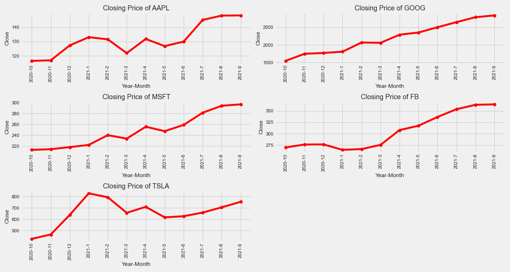
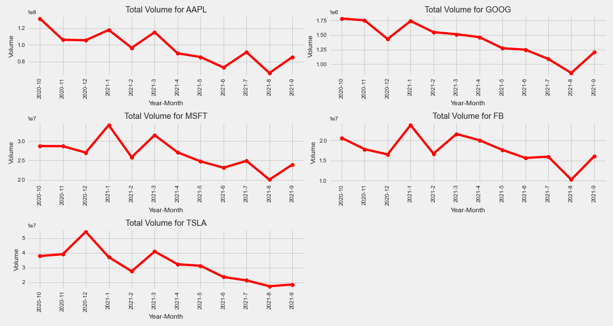
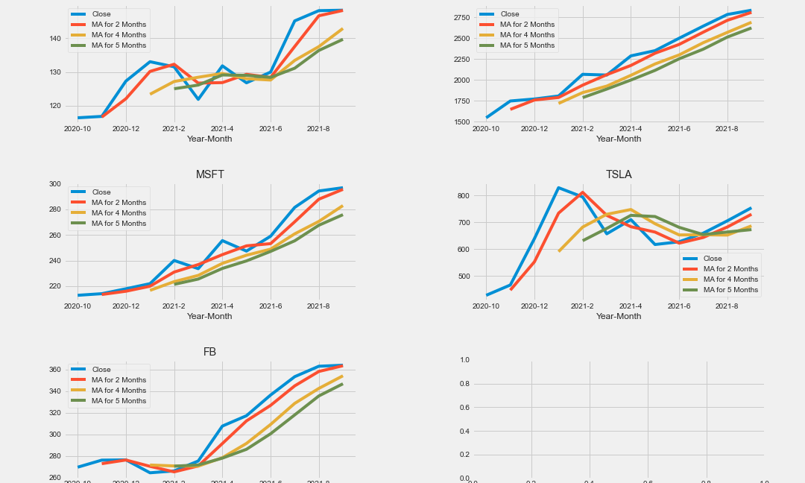
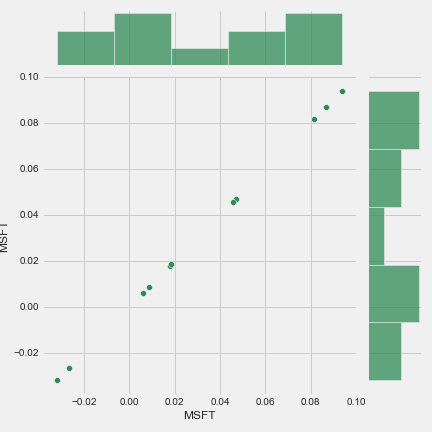
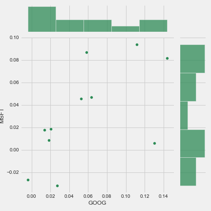
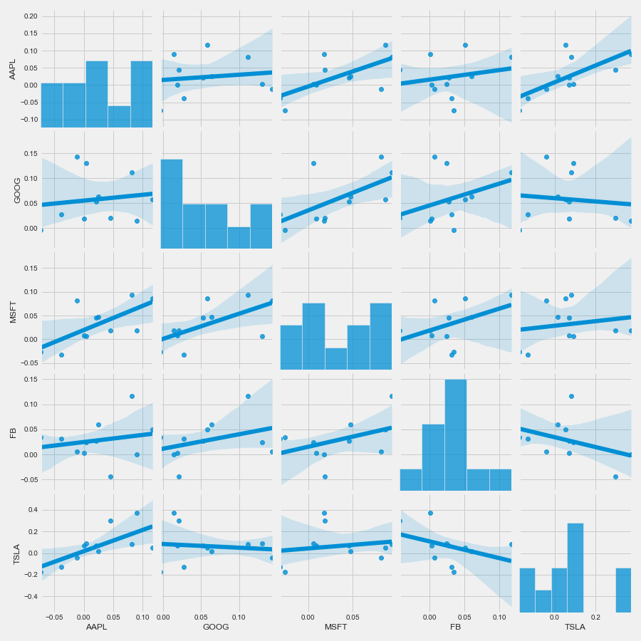

# Team: PrediLytics
## Project Name: Stock Market Analysis and Prediction

# Introduction
The goal of the project is to do technical analysis, visualization, and prediction using data provided by Google Finance. The project will use Numpy, Pandas, and Data Visualization Libraries (particularly matplotlib) to create figures and graphs to highlight the analysis. Data from the stock market, particularly some fortune 500 technological stocks and others.

# Stock Market Data

The initial data we used for this model is taken directly from Google finance. We used google sheet where we wrote a function to capture the data of last 5 years for the following stocks: GOOG,MSFT,FB,AAPL,and TSLA. Furthermore, We cleaned up the data by filter it out for rolling 12 month of data. We also added new column called 'Year-Month'.

## Research Questions and Analysis

1. What was the change in the price of the stock over time?

  In this analysis, python script was created to visualize the historical views of the closing price and volumne of the stocks. To complete this task, I have used     python library and matplotlib charts. I created two subplots to showcase the historical views by stocks.

**Closing Price by stocks**

**Volume by stocks**

2. What was the moving average of the various stocks?

We applied moving avearge logic for 2,4, and 5 months. we used closing price financial field for our analysis. To complete this task, I have used python library and matplotlib charts.

**Moving Average by stocks**

3. What was the correlation between different stocks closing prices?

In this analysis, we created a dataframe which we listed the stock closing volumes in columns and grouped by Year-Month. To complete this task, I have python library and seaborn.join plot. We have draw a plot of two variables with bivariate and univariate graphs. we have showed example of what is linear relationship when comparing with same stock vs different stocks.

**MSFT Vs MSFT**

**GOOG Vs MSFT**

We also used seaborn.pairplot to visualize grid of axes such that each variable in data will by shared in the y-axis across a single row and in the x-axis across a single column.

PairPlot Charts

